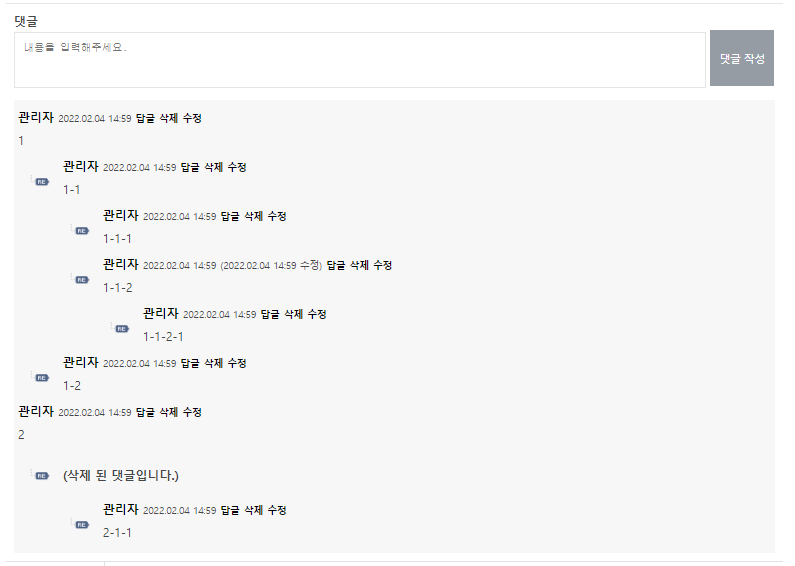

## 프로젝트 소개
기존에 Spring Framework로 개발되었던 프로젝트를 eGovFrameWork 형식으로 재구성

### 기간
- 2022-01-03 ~

## 변경점

### 도서
- 추천 도서 목록 CSS 변경
- 추천 도서 상세페이지 파라미터 ISBN에서 추천도서번호로 변경
- 도서 대출 시 연체도서 확인
- 비정상 접근시 메시지 출력

### 회원
- 탈퇴 회원 테이블 탈퇴 시간 컬럼 추가
- 회원 탈퇴시 탈퇴시간 입력
- 회원 테이블 enable 칼럼 tinyint(1)로 변경
- 회원 가입 시 INSERT 쿼리 수정

### 게시판

#### 공통
- 게시판 DB 수정시간 컬럼 추가
- 게시판 수정시간 출력
- 게시글 제목 JSTL형식으로 변경
 
#### 공지사항
- 공시사항 테이블 notice_img 컬럼삭제
- 공지사항 이전글, 다음글 출력 오류 수정
- 첨부파일 다운로드 로직 변경
- 첨부파일 이미지 섬네일 삭제(아이콘 일치화)

#### 분실물찾기
- 분실물찾기 게시판 첨부파일 삭제
- 분실물찾기 첨부파일 테이블 삭제

#### 문의사항
- 문의사항 작성자 명 마스킹
- 문의사항 답변 모두 출력(기존 1개만 출력)

### 열람실
- 나의 예약현황 페이지 열람실 명 제 1열람실로 고정되어있는 부분 수정

### 관리자
- 연체 도서 메일 발송 시 메일내용에 도서 제목, 반납 예정일 추가
- 희망도서 처리완료시 소장, 취소버튼 미출력
- 희망도서 취소사유 미입력시 취소 불가
- 관리자 관리 Controller 팝업 URL 오류 수정
 
### 공통
- URL 및 변수명 스네이크케이스에서 카멜케이스로 변경
- 전자정부에서 지원하는 HTML필터사용하여 XSS방지
- 상태관련 칼럼 tinyint(1)로 변경
- 각종 URL 및 명칭 버그 수정
- ContextPath 추가
- 관리자 계정 확인 방식 SQL 검색 -> request 이용으로 변경
- Lombok @Data에서 @Getter, @Setter 로 변경

## 추가기능

### 계층형 댓글
댓글 이미지|
|---|

